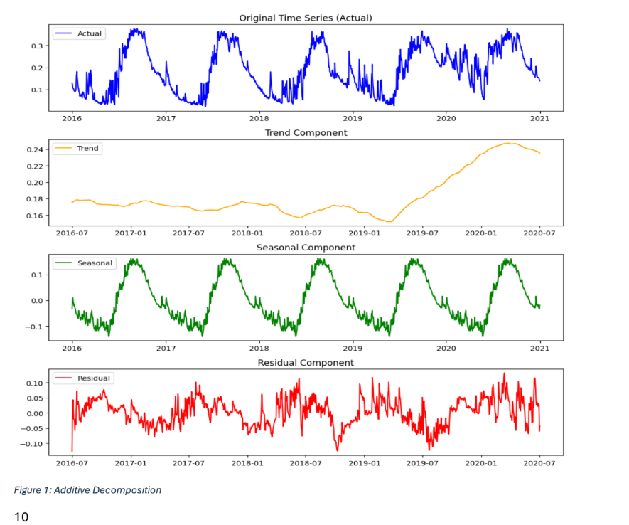
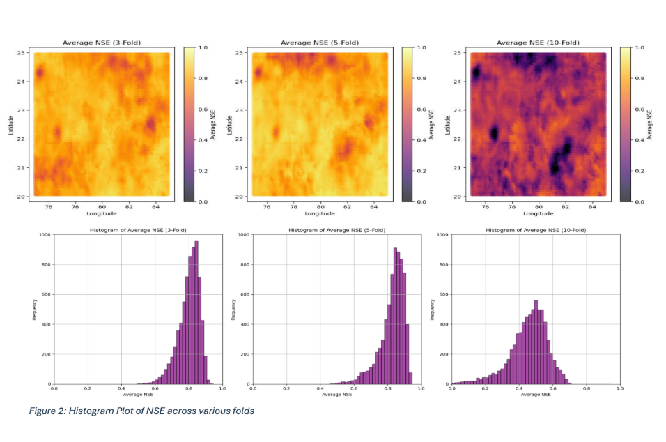
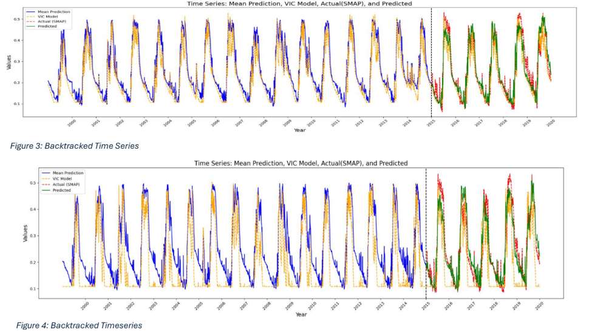
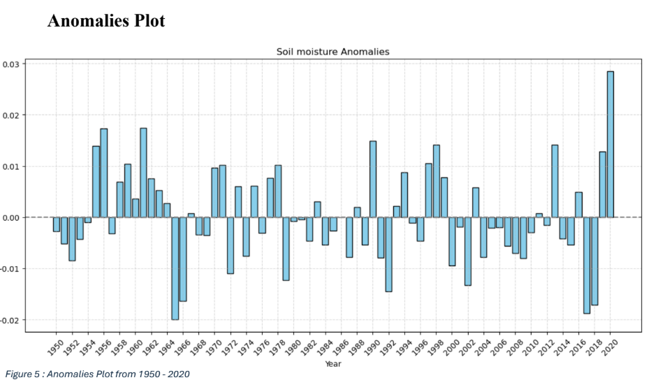

# SMAP Soil Moisture Backward Reconstruction using Machine Learning

This project focuses on reconstructing historical soil moisture time series data by leveraging machine learning models trained on SMAP (Soil Moisture Active Passive) satellite data. Due to SMAP data availability being limited to 2015 onwards, this work aims to backtrack (reconstruct) soil moisture from earlier periods using physically-based model outputs and statistical learning techniques.

---

## 🌍 Project Objective

- **Goal**: Reconstruct pre-2015 soil moisture data using post-2015 SMAP satellite observations and VIC (Variable Infiltration Capacity) model data.
- **Approach**: Train ML models (e.g., regression, ensemble methods) on observed SMAP + VIC data to learn patterns and use those to estimate past values.
- **Key Output**: Backtracked soil moisture time series from 1950–2015.

---

## 🔬 Methodology

1. **Data Sources**:
   - **SMAP** satellite soil moisture data (post-2015)
   - **VIC Model Outputs** (1950–2020, hydrological model)
   - **Climate & Hydrology Inputs** (e.g., temperature, precipitation)

2. **Preprocessing & Decomposition**:
   - Time-series decomposition (trend, seasonality, residuals)
   - Resampling and aligning SMAP/VIC timelines
   - Feature engineering

3. **Modeling**:
   - Used ML models (like Random Forest, XGBoost, Linear Regression)
   - K-fold cross-validation (3, 5, 10 folds)
   - Metrics: Nash-Sutcliffe Efficiency (NSE)

4. **Backtracking**:
   - Models trained on post-2015 SMAP+VIC
   - Used to predict soil moisture for pre-2015 using VIC features

---

## 📊 Key Results

| Visualization | Description |
|---------------|-------------|
|  | Time-series decomposition of SMAP data |
|  | NSE performance across 3/5/10 fold CV |
|  | Backtracked soil moisture (2000–2020) |
|  | Anomaly trends in backtracked soil moisture (1950–2020) |

---

